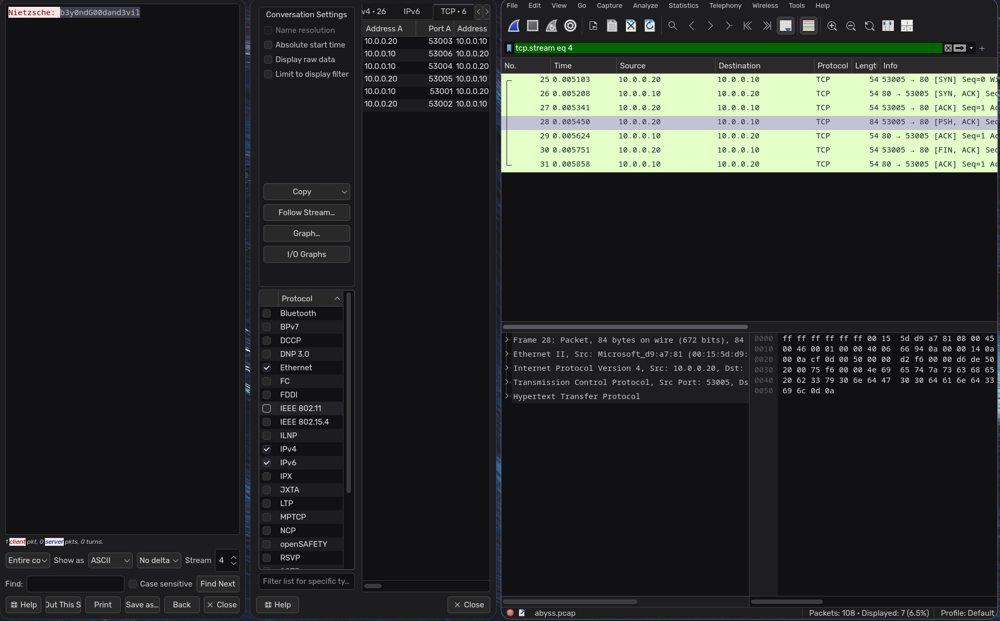

# FORENSICS
# RARofABYSS
## CHALLENGE
we are given a pcap file and told that it contains a convo
## FLAG 
`nite{thus_sp0k3_th3_n3tw0rk_f0r3ns1cs_4n4lyst}`
## MY SOLVE
1. i open the .pcap file using wireshark.
2. head to statistics/conversations/tcp
3. read all the tcp convos through follow stream
4. in one i find random garbage values starting with RAR.
5. so i save them as abyss.rar.
6. in another stream, i find password as `b3y0ndG00dand3vil`
7. 
8. next i fire up 7z to extract the contents using the pw.
9. it gives me a file.txt which contains flag
10. flag is `nite{thus_sp0k3_th3_n3tw0rk_f0r3ns1cs_4n4lyst}`
## LEARNING
1. learning to analyse pcap files
2. reconstructing a rar file from the tcp stream
