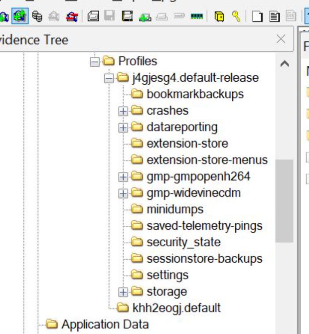
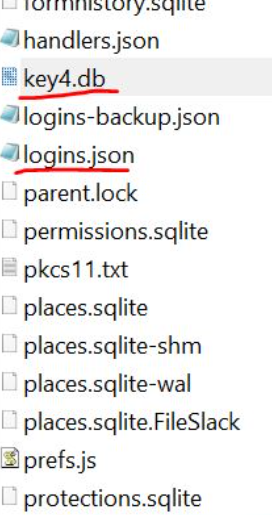
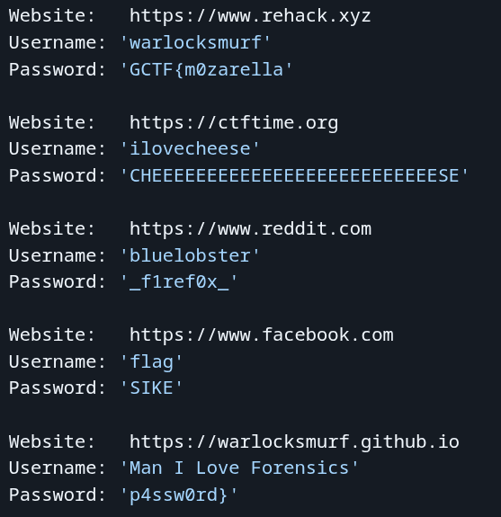

# FORENSICS
# NINETAILS
## CHALLENGE
Looks like I got a little too clever and hid the flag as a password in Firefox, tucked away like one of NineTails’ many tails. Recover the "logins" and the "key4" and let it guide you to the flag Hint: I named my Ninetails "j4gjesg4", quite a peculiar name isn't it?
## FLAG
`GCTF{m0zarella_f1ref0x_p4ssw0rd}`
## MY SOLVE
1. In this challenge, I’ve got a disk image where the creator says they hid the flag as a Firefox password. So my plan is pretty simple. pull out Firefox’s logins and key4, decrypt the saved logins, and see what shows up. The hint about their Ninetails being named j4gjesg4 is probably just the identifier I’ll spot when I go through the recovered credentials.
2. so initially i spent a lot of time searching for ways to open the .ad1 file on arch and failed miserably. it has no support on the official arch repos. hence i shifted to windows for this challenge
3. i open up the disk image using `FTKIMAGER`, go thru the folders and find firefox.
4. 
5. the q asks me to search for key and logins. i get them from the profiles tab.
6. 
7. i extract them and i discover a tool called `firefox_decrypt` on github to crack the login and the passwords. 
8. i fire that tool up with the .json and .db file obtained from prev steps.
9. 
10. from this i get the flag as `GCTF{m0zarella_f1ref0x_p4ssw0rd}`

## LEARNING
1. A `.rar` file is basically just an archive — pretty much a compressed folder with a bunch of files inside.

2. An `.ad1` file is a disk image format you usually see in forensics tools like FTK Imager, so it keeps the whole filesystem structure intact, including metadata and deleted artifacts.

3. An `.stl` file is for 3D printing/CAD, so it’s not relevant for what I’m doing here. i got this when i extracted the .rar file. 
4. `logins.json` → contains the encrypted usernames, passwords, and host metadata.  
5.  `key4.db` → stores the NSS key material used to decrypt entries from `logins.json`.  
6. `cert9.db` → holds certificate info that NSS uses to unwrap the decryption keys.(optonal)

