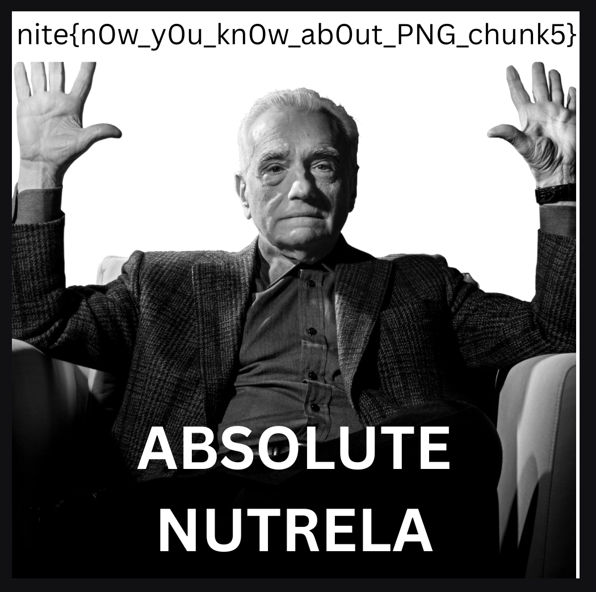

# FORENSICS
# NUTRELA CHUNKS
## CHALLENGE
we are given an image with broken chunks. we are supposed to correct em to obtain image.
## FLAG
`nite{n0w_y0u_kn0w_ab0ut_PNG_chunk5}`

## MY SOLVE
1. i download the file and run exiftool on the file
2. it tells me that its a png file but there is a file format error. so i open hexedit and check for header chunks. 
3. i notice discrepancies. the header info is in lowercase. IDAT is written as idat. so i change the hex values and run exiftool again
4. this time it tells theres mistake in IHDR. again samething. its been written in lowercase. so i edit that to
5. now i check the file with exiftool and it returns that its a truncated png imahge
6. now after running pngcheck on it, i get 
```
    File: nutrela.png (538662 bytes)
    chunk IHDR at offset 0x0000c, length 13
        1000 x 1000 image, 24-bit RGB, non-interlaced
    chunk idat at offset 0x00025, length 538605:  illegal reserved-bit-set chunk
    ERRORS DETECTED in nutrela.png

```
7. so i change the bits again at 0x24 and now image is visible
8. 
9. flag is found `nite{n0w_y0u_kn0w_ab0ut_PNG_chunk5}`

## LEARNING
1. idat, ihdr and similar headers in a classic png image.
2. using pngcheck to pinpoint incorrect hex values inbetween the file
