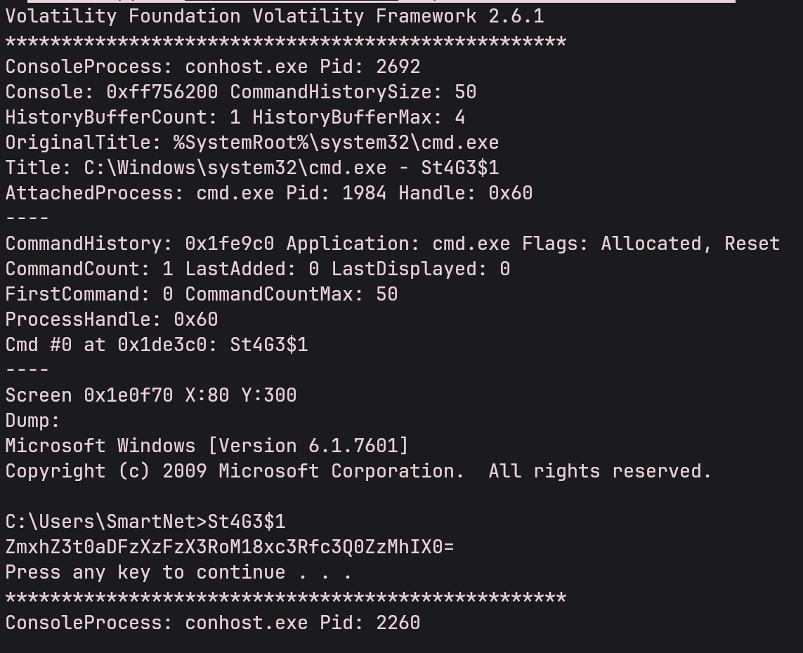
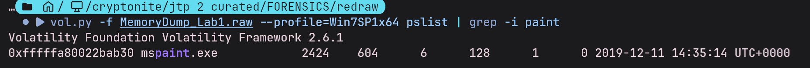
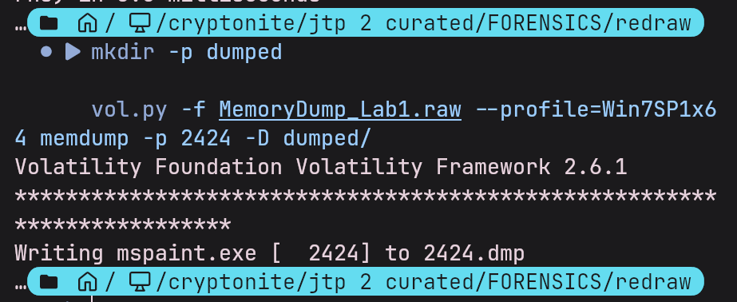
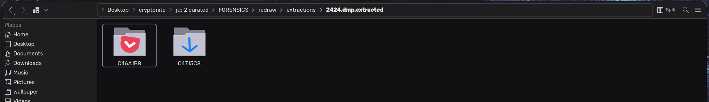
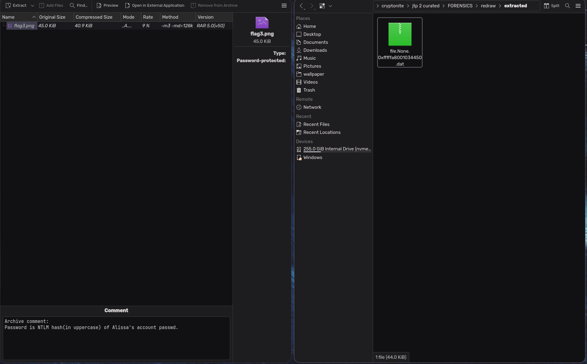
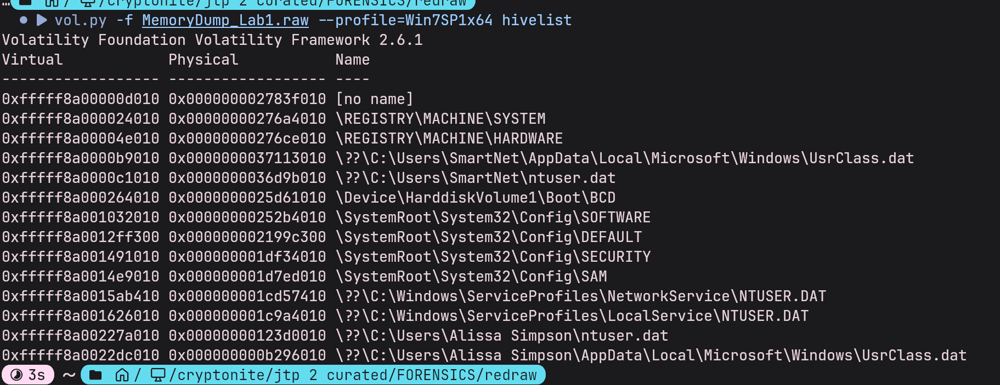
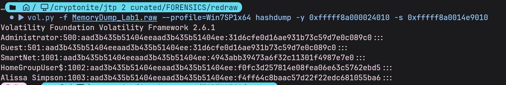
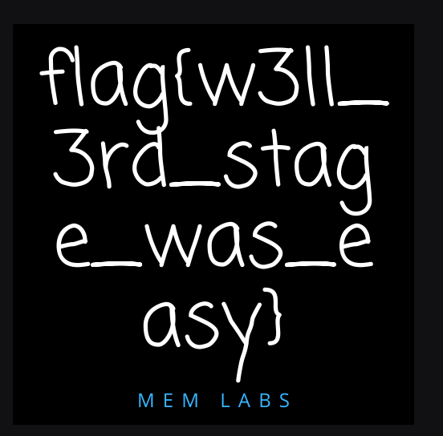

# FORENSICS
# RE-DRAW
## CHALLENGE
Her screen went black and a strange command window flickered to life, lines of text flashed across before everything went silent. Moments later, the system crashed. By sheer luck, we recovered a memory dump. 

Note: There are three stages to this challenge and you will find three flags.

What we know: just before the crash, a black command window flickered across the screen, something in its output might still be visible if you dig through memory. She was drawing when it happened, and remnants of a painting program linger, which could reveal more if inspected in the right way. Finally, a mysterious archive hides deeper in memory, likely holding the last piece of her work.
## MY SOLVE
1. i open up the `.raw` file using volatility2 and run this following command `  vol.py -f MemoryDump_Lab1.raw --profile=Win7SP1x64 consoles`
2. i run that because the screen flickered black hinting at powershell/consoles/ similar applications. 
2. i get the output as
3. 
4. the seemingly random lines on text (`ZmxhZ3t0aDFzXzFzX3RoM18xc3Rfc3Q0ZzMhIX0=`) seem like they are base 64 encoded. i decode them and they yeild `flag{th1s_1s_th3_1st_st4g3!!}`
5. the next flag is related to drawing/painting. so mspaint maybe?
6. i run `vol.py -f MemoryDump_Lab1.raw --profile=Win7SP1x64 pslist | grep -i paint`
7. that gives me the pid and other attributes of mspaint
8. 
9. so now i dump the memory of mspaint (pid = 2424) into a different directory by running this
10. 
11. now i run `binwalk -e dumped/2424.dmp` 
12. it gives me with 2 images  pointing me downwards
13. so now i move back to the entire dump and search for rar files
14. i find 3 `important.rar` files
15. ```bash
    0x000000003fa3ebc0  \Users\Alissa Simpson\Documents\Important.rar
    0x000000003fac3bc0  \Users\Alissa Simpson\Documents\Important.rar
    0x000000003fb48bc0  \Users\Alissa Simpson\Documents\Important.rar
    ```
16. now i make a folder named extracted and run this command `vol.py -f MemoryDump_Lab1.raw --profile=Win7SP1x64 dumpfiles -Q 0x000000003fa3ebc0 -D extracted/` to extract that rar.
17. i open it up and see a flag3.png but its password protected
18. 
19. its asking for alissa's ntlm hash. NTLM (NT LAN Manager) is a Microsoft security protocol suite for user authentication, integrity, and confidentiality
20. so i run `hivelist` to find all registries loaded in memory and print their addressess. `SAM` contains user info. `SYSTEM` contains boot key needed to decrypt SAM.
21. 
22. i run `vol.py -f MemoryDump_Lab1.raw --profile=Win7SP1x64 hashdump -y 0xfffff8a000024010 -s 0xfffff8a0014e9010` to dump the hashes
23. i get following op
24. 
25. i get the hash and uppercase it. its the rar password `F4FF64C8BAAC57D22F22EDC681055BA6`
26. i unrar it and it gives this .png
27. 
28. `flag{w3ll_3rd_stage_was_easy}`
## LEARNINGS
1. how to profile memory images properly  
2. how to extract console history, GUI artifacts, and embedded files  
3. how to locate and dump real file objects from RAM  
4. how Windows registry hives, password hashes, and NTLM authentication work in memory  
5. how to apply Volatility plugins together to build a complete investigative chain  
