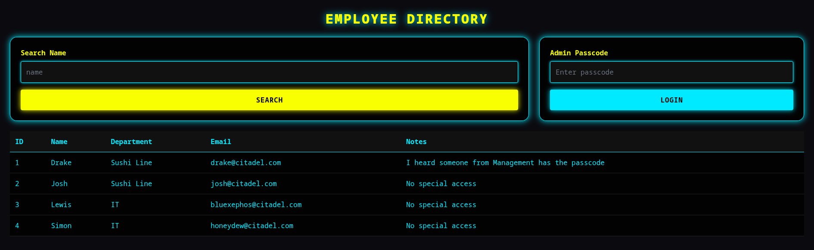
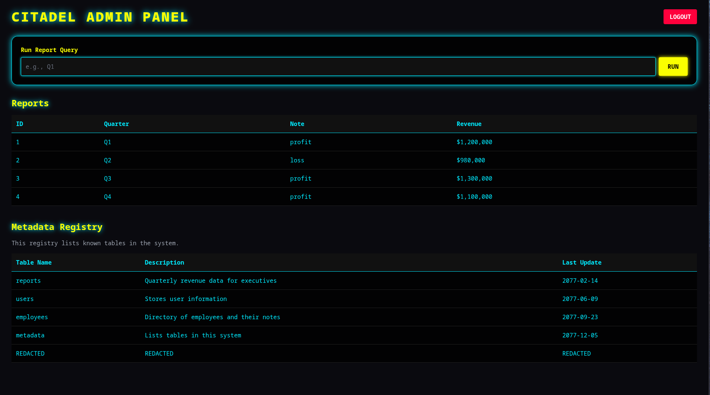
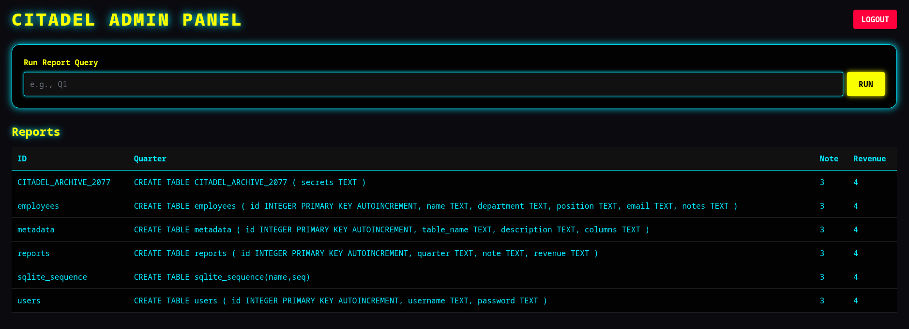

# DATABASE INCURSION
## CHALLENGE
we ve been given a website with a login form with space for uname and pw. 
## FLAG 
`CITADEL{571ll_d0n7_kn0w_1f_175_53qu3l_0r_5ql?}	`
## MY SOLVE
1. i first tried my luck with sql injection
2. passed ` admin'or 1=1 --` and garbage for password and it successfully bypassed the entry
3. i was then greeted with this 
4. now i just enter ' into search and i get this `SQL error: unrecognized token: "''' ORDER BY id LIMIT 4"`
5. that means there is a limit on the records returned. i need to increase that to view people with management
6. so the real sql query must be somewhat like this
7. ```
    SELECT id, name, department, email, notes
    FROM employees
    WHERE name LIKE '%<INPUT>%'
    ORDER BY id LIMIT 4;
    ```

8. so i run this `' OR 1=1 ORDER BY id DESC --` to sort it by descending order and comment out rest of the query
9. now i can see user `kiwi` along with their password. i proceed to login
10. can now view this dashboard 
11. 

12. so yeah it lies in redacted. to see what lies in redacted, we need the source sql code on how the tables were formed. so i try union.

13. since ' was throwing errors, it means sqlite is being used. and `sqlite_master` stores all infor about the tables.

14. so i run this `' UNION SELECT name, sql, 3, 4 FROM sqlite_master--` .
15. here, name is to show name, sql is to show the table structure so that we can manipulate it and 3,4 are there just to fulfil the no. of coloumns criterion. 
16. after i run this, i get this page
17. 
18. so there our flag is. inside `citadel_archive_2077`
19. since there are 4 coloumns and i dont know which coloumns has `secrets`, i run `' UNION SELECT secrets, secrets, secrets, secrets FROM CITADEL_ARCHIVE_2077--`
20. this prints the flag for me `CITADEL{571ll_d0n7_kn0w_1f_175_53qu3l_0r_5ql?}	`

## LEARNING
1. so after this challenge, i have a general workflow to approach sqli based problems
    it starts by checking if sqli can be posisble by injecting ' first. if error message pops then its sql is vulnerable
    1. break it with '

    2. confirm injection with ' OR 1=1--

    3. determine column count

    4. UNION SELECT via sqlite_master

    4. look for sensitive tables

2. input validation is the solution against all this. parameterised queries can help solve this type of vulnerabilities
